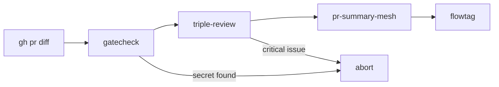

# dotmoo

> **The portfolio operator: one command, many repos.** Pure Bash CLI that wraps `gh` + `jq` for fleet operations across an entire GitHub portfolio. Status table across all repos, fan-out semver bumps, batch PR audits, full review-summarize-release chains in one shot. No compiler, no venv, no toolchain — just `bash 4+`, `gh`, and a 50-line config.

[](https://github.com/M00C1FER/dotmoo/actions)


## What this is, exactly

Other tools (`maxbeizer/gh-fleet`, `qskkk/git-fleet`, `mu-repo`, `meta`) handle multi-repo *git* operations. **dotmoo handles multi-repo *AI-tooling* operations** — chain `kingfisher` → `mesh-review` → `release-please` across an entire portfolio with one invocation. It's the conductor for the rest of your dev-tool stack, not a replacement for any one tool in it.

## What it does

Fans common operations out across every repo in your portfolio:

| Subcommand | Purpose |
|---|---|
| `dotmoo status` | Table of CI / stars / forks / issues / last-commit across every repo |
| `dotmoo bump [--apply]` | Run `flowtag --next-version` across every repo with new commits |
| `dotmoo audit owner/repo#42` | Run `triple-review` on a single PR's diff |
| `dotmoo audit --all` | Run `triple-review` on every open PR across every repo |
| `dotmoo summary owner/repo#42` | Run `pr-summary-mesh` on a single PR |
| `dotmoo cycle owner/repo#42` | Full chain: gatecheck → triple-review → pr-summary-mesh → flowtag |
| `dotmoo list` | Print configured repo list |
| `dotmoo config` | Print resolved config + path |
| `dotmoo version` | Print version |

## Why Bash here

The load characteristic is **glue + composition**. Each subcommand wraps `gh api` + `jq` in 5–30 lines. Three reasons Bash is the right tool:

1. **Pure composition** — `gh` already does 95% of the work. Bash's role is "loop over repos and call gh"; that's classic shell scripting territory.
2. **Zero build step** — install is `cp dotmoo /usr/local/bin`. No compiler, no venv, no toolchain.
3. **Discoverable internals** — every subcommand lives in `lib/dotmoo-<verb>.sh` as readable shell. Fork and customize without learning a new language.

A Python version would add a 50 MB venv for what's a 30-line script. A Go version would compile a binary that re-implements `gh` calls. Both are wrong for this load.

## Quick start

```bash
git clone https://github.com/M00C1FER/dotmoo.git
sudo cp dotmoo/bin/dotmoo /usr/local/bin/
sudo cp -r dotmoo/lib /usr/local/share/dotmoo/
export DOTMOO_LIB=/usr/local/share/dotmoo

dotmoo version            # creates ~/.dotmoo/portfolio.toml on first run
$EDITOR ~/.dotmoo/portfolio.toml   # add your repos
dotmoo status
```

(Or use the install wizard: `bash <(curl -fsSL https://raw.githubusercontent.com/M00C1FER/dotmoo/main/install.sh)`)

## Configuration

`~/.dotmoo/portfolio.toml`:

```toml
[portfolio]
default_owner = "your-handle"
repos = [
    "polite-fetch",
    "mcp-citation-research",
    "triple-review",
    "memory-anthropic-api",
    "recon-orchestrator",
    "flowtag",
    "pr-summary-mesh",
    "gatecheck",
    "dotmoo",
]
```

The TOML reader is intentionally minimal (`awk`-based) so dotmoo doesn't need an external TOML parser.

## How it composes with the rest of the portfolio

`dotmoo cycle owner/repo#42` runs the full PR check sequence:



Each tool is independent — `dotmoo` just orchestrates. If a tool isn't installed, `dotmoo cycle` warns and continues with the rest. Best-effort by design.

## Cross-platform

| OS | Shell | Status |
|---|---|---|
| Debian 13 / Ubuntu 22.04+ | bash 4+ | ✅ tested |
| WSL2 (Ubuntu / Debian) | bash 4+ | ✅ tested |
| Fedora / RHEL | bash 4+ | ✅ should work (relies only on POSIX `awk`/`sed`) |
| Arch / Alpine | bash 4+ | ✅ should work |
| macOS | bash 5+ (`brew install bash`) | ✅ should work; default macOS bash 3.2 won't suffice |
| Windows native | n/a | use WSL2 or Git Bash |

Required tools: `bash 4+`, `gh`, `jq` (optional but enables prettier output for some commands), `git`.

## Comparison vs alternatives

| Tool | Lang | Build needed | Multi-repo | Custom subcommands |
|---|---|:-:|:-:|:-:|
| `gh` (alone) | Go | ✅ | partial | ❌ |
| `mu-repo` | Python | ✅ (pip) | ✅ | ❌ |
| `meta` | Node | ✅ (npm) | ✅ | ✅ via JSON config |
| **`dotmoo`** | **Bash** | **❌ (just cp)** | **✅** | **✅ via lib/* drop-ins** |

## Testing

```bash
bash tests/test_dotmoo.sh
```

5 smoke tests cover: config bootstrap, repo list parsing, owner readback, unknown-command exit, help output. Tests run against an isolated `$HOME` so they don't touch a real config.

## Roadmap

- v0.2: `dotmoo init <repo>` — scaffold a new repo with the portfolio's CI + structure
- v0.3: `dotmoo release <repo>` — automated tag-and-publish chain (uses flowtag + gh)
- v0.4: `dotmoo dashboard` — TUI live view via `tput`/`watch`

## License

MIT.
